# DylanDavidson_T3A2-A

---

## REmind_M3 Full Stack App (Part A)

 [T3A2-A Github Repo](https://github.com/Cheese-steak-jimmys/REmind_M3-docs)

 [T3A2-A Trello board](https://trello.com/b/ji5PjIUX)

## Table of Contents

- [Description](https://github.com/Cheese-steak-jimmys/REmind_M3-docs#description)
- [Purpose](https://github.com/Cheese-steak-jimmys/REmind_M3-docs#purpose)
- [Functionality/Features](https://github.com/Cheese-steak-jimmys/REmind_M3-docs#functionality--features)
- [Target Audience](https://github.com/Cheese-steak-jimmys/REmind_M3-docs#target-audience)
- [Tech Stack](https://github.com/Cheese-steak-jimmys/REmind_M3-docs#tech-stack)
- [Dataflow Diagram](https://github.com/Cheese-steak-jimmys/REmind_M3-docs#dataflow-diagram)
- [Application Architecture](https://github.com/Cheese-steak-jimmys/REmind_M3-docs#application-architecture-diagram)
- [User Stories](https://github.com/Cheese-steak-jimmys/REmind_M3-docs#user-stories)
- [Wireframes](https://github.com/Cheese-steak-jimmys/REmind_M3-docs#wireframes)
- [Trello Board](https://github.com/Cheese-steak-jimmys/REmind_M3-docs#Trello-Board)

---------------------------  

### Description

REmind_M3  
Have you ever missed an astronomical event, like witnessing the blood moon in 2022 or missing a show when your favourite 90's artist was in town?

Maybe you didn't know? Maybe you did and forgot?

This is an app that will give you a notification when you don't want to miss out on something.  
Create events for your eyes only or viewable on a public forum. Add someone else's to your list, who knows what you may discover.

---

### Purpose

The purpose of this application is to help people stay informed by keep ahead of events, get the most out of their interests and share with others.

---

### Functionality / features

- Create events that trigger an alert at a desired time and date.
- View main listings as a guest user or sign up to obtain a profile.
- Edit and delete events.
- Events can be private or viewable to all on a public wall.
- View and save others events, get notifications when they do.
- Responsive design.

---

### Target Audience

The target audience for this app is mostly young adults that feel as though time is speeding up.  
This application could be recommended to all adults, professionals and anyone that has ever said "I would have liked that, but I had no idea about it."

---

### Tech Stack

### **Front-end**

 HTML

 JavaScript

 CSS

 React

#### **Back-end**

 NodeJS

 ExpressJS

#### **Database**

 MongoDB

 Mongoose

#### **Project Management Tools**

 Trello

#### **Testing**

- [Cypress](https://www.cypress.io/)
- [Jestjs](https://jestjs.io/)

#### **DevOps Tools**

 Git

 GitHub

 Visual Studio Code

[Postman](https://www.postman.com/)

#### Design Tools

[Figma](https://www.figma.com/)

[Lucidchart](https://www.lucidchart.com/pages/what-is-a-flowchart-tutorial#top)

 [DALL-E Image Generator](https://www.bing.com/create)

[Canva](https://www.canva.com/)

[Balsamiq](https://balsamiq.com/)

[Excalidraw](https://excalidraw.com/)

## Dataflow Diagram

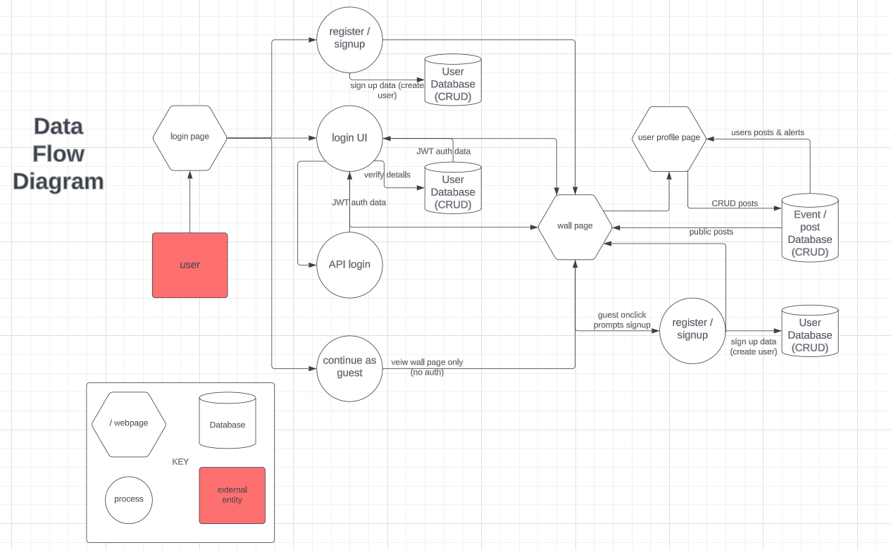

#### Detail

1. The user interacts with the User Interface (UI) to log in, create an account, continue as a guest, or log in using an API from GitHub or Google.

2. If the user chooses to log in using an API, the browser sends a request to the Server to authenticate the user through the selected API.

3. If the user chooses to log in or create an account, the browser sends the appropriate request to the Server, which authenticates the user’s credentials or creates a new account in the Database.

4. Once authenticated or if continuing as a guest, the user can view posts on a public wall through the UI, which sends a request to the Server to retrieve public posts from the Database.

5. If the user is a guest and checks a box next to a post to indicate that they would like to receive notifications for the event described in that post, they are prompted to sign up for an account.

6. If the user is logged in, they can create a new post through the UI, specifying whether it should be private or public and including information about an event (such as date and time).  
   _The user may also choose to include a GIF from Giphy which sends a request to the Giphy API to retrieve relevant GIFs. This is only the case if I have time to include it._

7. The UI sends a request to the Server to store the post in the Database.

8. The user can also view their profile page through the UI (if logged in), which sends a request to the Server to retrieve all of their posts (both private and public) as well as public posts from other users that they have checked to receive notifications for.

9. When an event described in a post occurs, the Server sends a notification to the user through the UI (if logged in).

10. The Server processes these requests and sends responses back to the UI, which displays the data to the user.

## Application Architecture Diagram

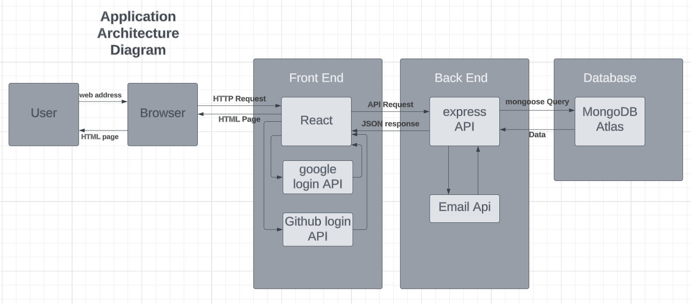

## User Stories

As a working student, I want to stay ahead of things and I will use this service to help achieve that.

As a guest user, I want to be able to view posts on a public wall and indicate that I would like to receive notifications for events described in those posts so that I can stay informed even if I don't have an account.

As a person that gets fixated on the things that interest me most, I want to be reminded about some of the events that I know I will leave to the last second, or not at all.

As a city lover, I would like to see some of the events my fellow dwellers are getting up to. Its bound to be good.

As someone with a passion for drama, I'm going to make public events that can notify others (if they choose) when theatre and ballet productions are coming to town.

### User Personas to assist with agile methodology project managment

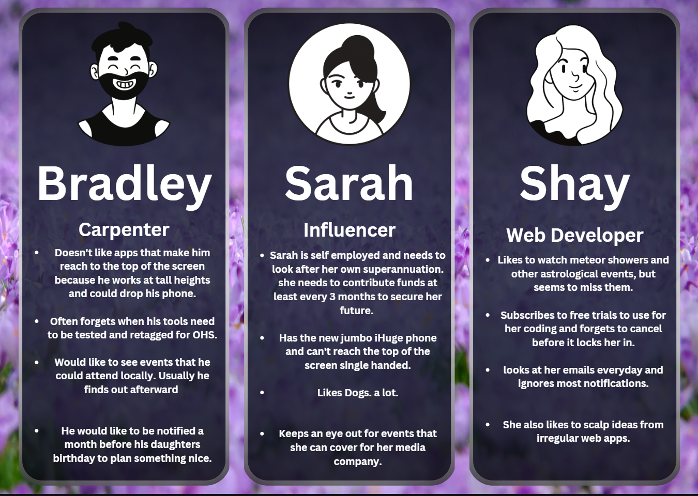

## Wireframes

#### Homepage (raw)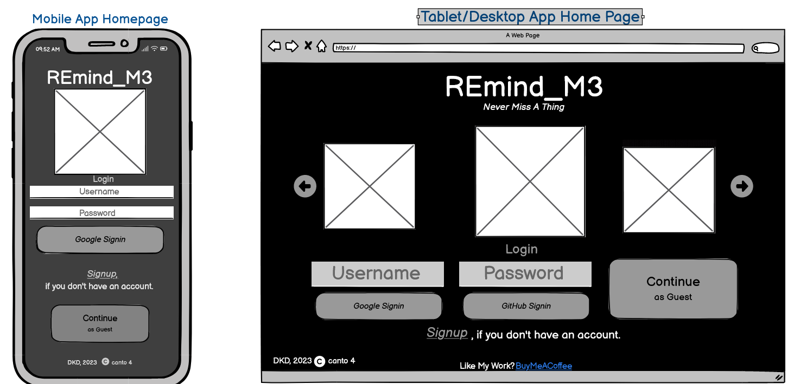

#### Homepage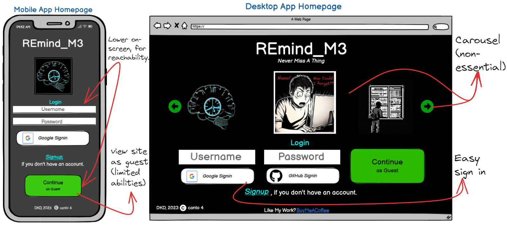

#### Homepage - Signup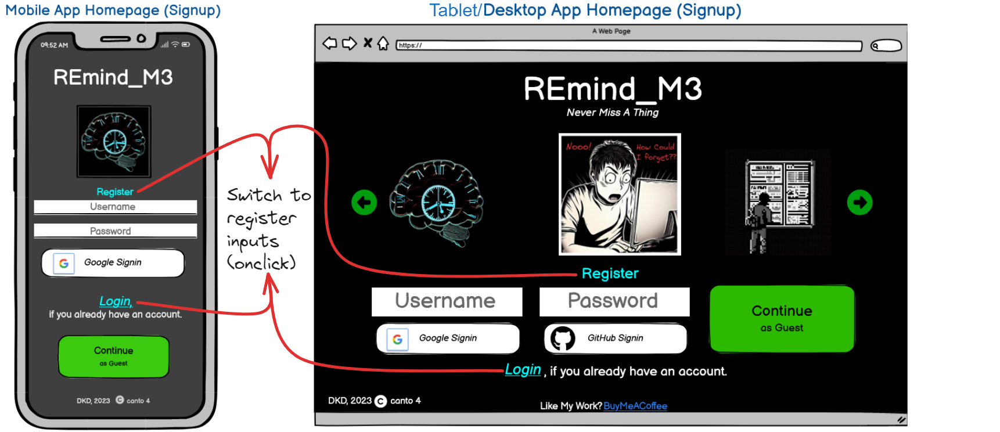

#### Wall Page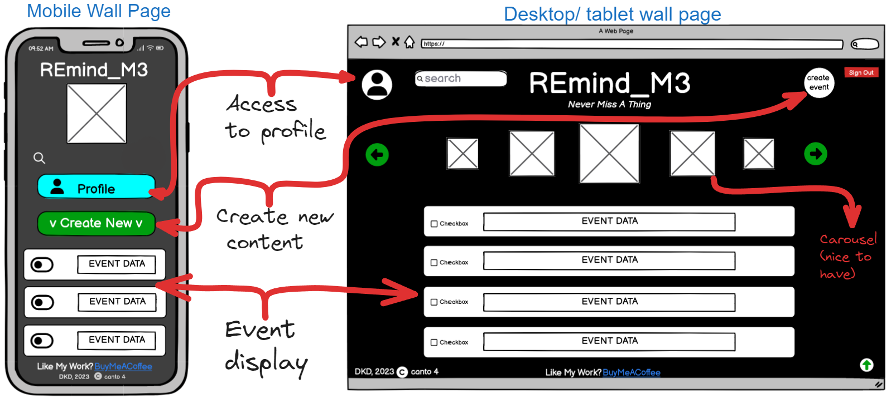

#### Profile Page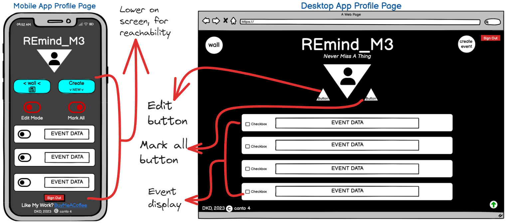

---

## Trello Board (Kanban)

#### Kanban Starting Point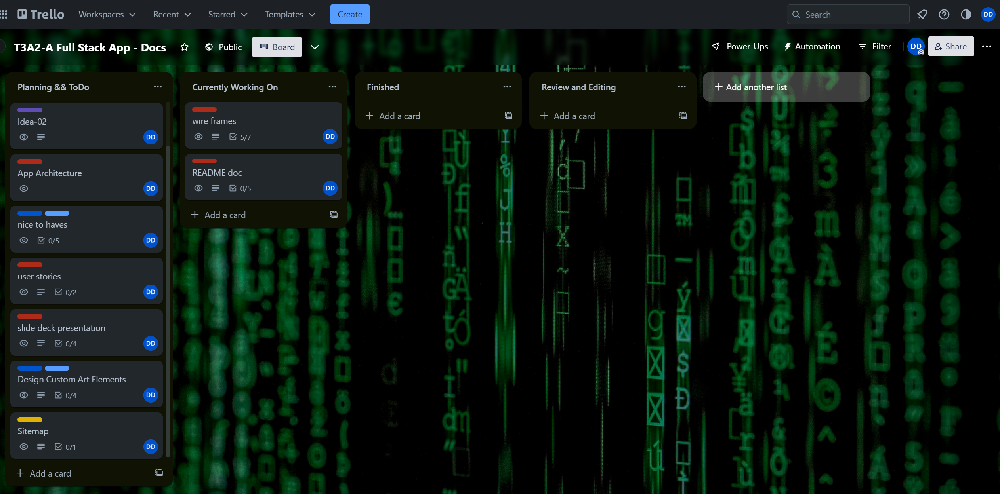

#### Making Card labels for priority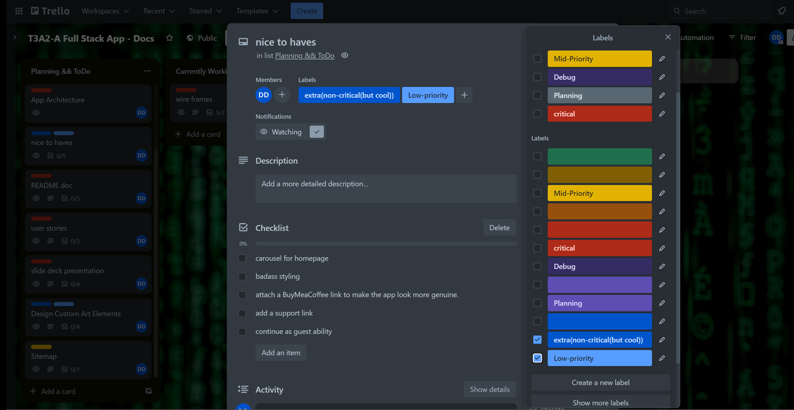

#### Progression of agile method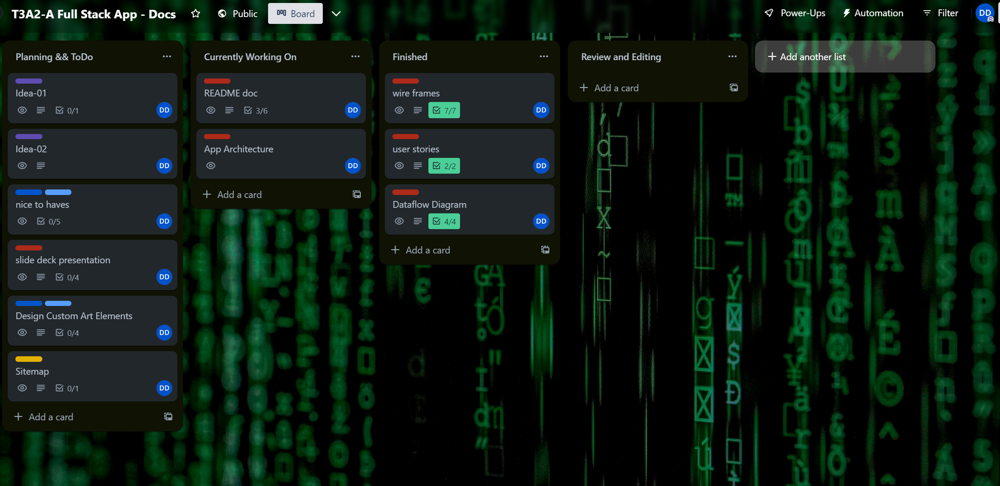

#### More cards complete and some moved to the T3A2-B board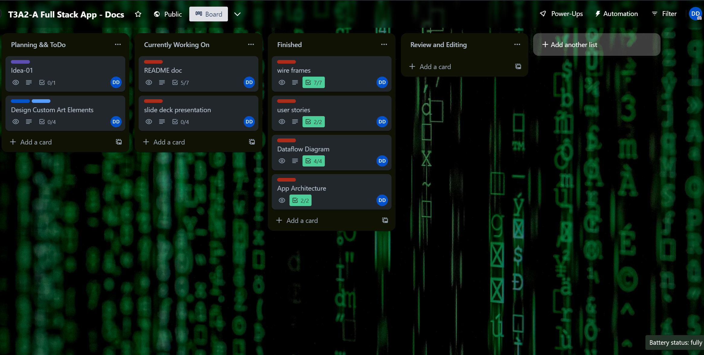
